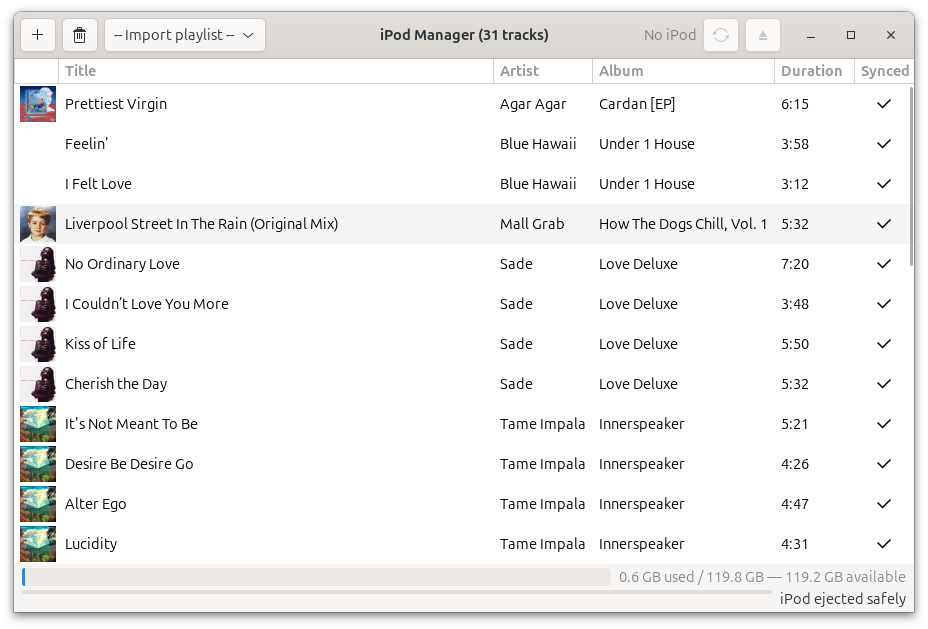

# ipod-manager



GTK4 music manager for iPod Classic. Add tracks, import playlists, sync to your iPod. It works.

Built with Claude in 30 minutes.

## Usage

```
/usr/bin/python3 /home/liam/Music/ipod-manager/ipod_manager.py
```

## License

[WTFPL](http://www.wtfpl.net/)
